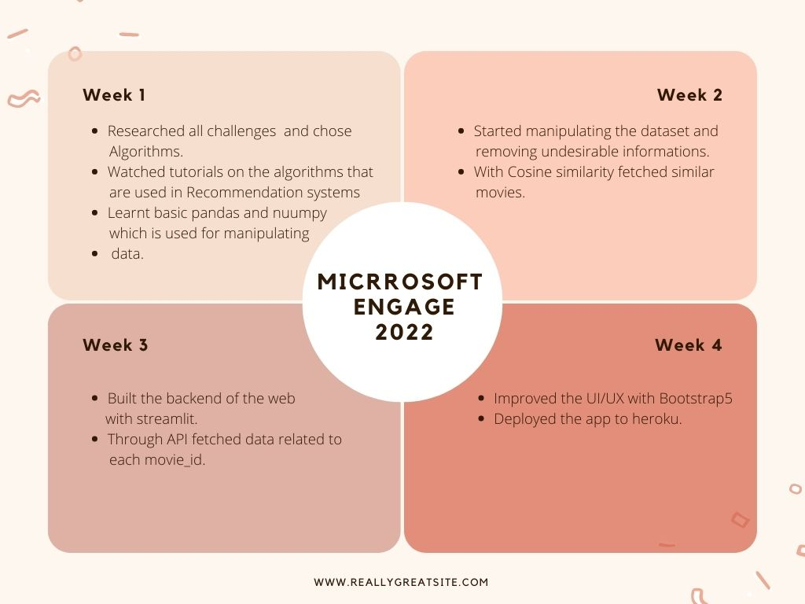

# Movie-Mania
Content Based Movie Recommendation System using cosine similarity.

#### Submission for Microsoft Engage 2022

### About
This repository demonstrates content based movie recommendation system through similarities in genres, cast, directors etc.

Steps involved in making:
1. Manipulate the dataset using pandas in jupyter notebook and eliminating undesirable informations.
2. Using cosine similarity fetch the similar movies.
3. Develope it in pycharm using streamlit.
4. Through API key fetch the data related to movie.
5. Deploy it to heroku.

### Scrum


### Prerequisites

This is an example of how to list things you need to use the software and how to install them.

-   pip
    ```sh
    python -m pip install –upgrade pip
    ```
    
### Installation

1. Clone this repository in your local system.
2. Install all the libraries mentioned in the [requirements.txt] file with the command `pip install -r requirements.txt`.
3. Create an account in https://www.themoviedb.org/, click on the `API` link from the left hand sidebar in your account settings and fill all the details to apply for API key. If you are asked for the website URL, just give "NA" if you don't have one. You will see the API key in your `API` sidebar once your request is approved.
4. Replace YOUR_API_KEY
5. Open your terminal/command prompt from your project directory and run the `app.py` file by executing the command `python app.py`.
6. Go to your browser and type `http://192.168.43.215:8501` in the address bar.

### Built With

This project is made with :

-   [Streamlit](https://streamlit.io/)
-   [Pandas](https://pandas.pydata.org/)
-   [Numpy](https://numpy.org/)
-   [Pickle](https://docs.python.org/3/library/pickle.html)
-   [nltk](https://www.nltk.org/)

### Future Scope
- Adding IMDb links of each recommended movie.
- Displaying casts, genres.
- Adding short bios of the casts.

### Sources of the datasets 

1. [IMDB 5000 Movie Dataset](https://www.kaggle.com/carolzhangdc/imdb-5000-movie-dataset)
